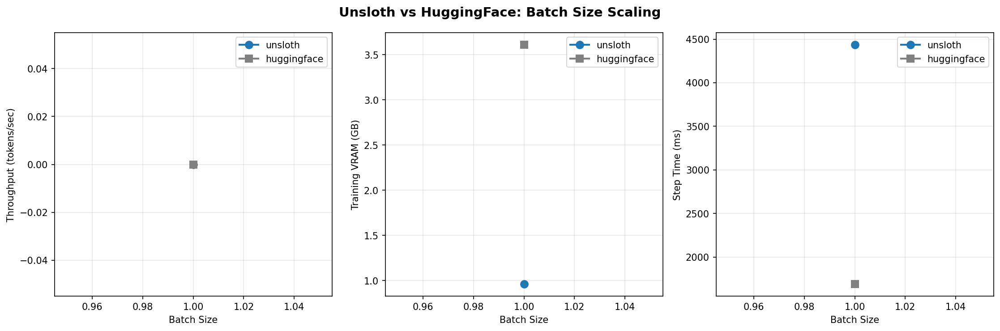

# GLM 4.7 Flash Benchmark: Unsloth vs HuggingFace

**Generated:** 2026-01-31 22:09:34

**Git commit:** 9ab64773

**Model:** unsloth/GLM-4.7-Flash

**Steps per config:** 5

**GPU:** NVIDIA RTX PRO 6000 Blackwell Server Edition (95.0 GB)

## Batch Size Scaling

Fixed sequence length: 2048

### Results

| dimension   |   value | framework   |   batch_size |   seq_length |   tokens_per_second |   training_vram_gb |   step_time_ms |   peak_vram_gb |   final_loss | status   |
|:------------|--------:|:------------|-------------:|-------------:|--------------------:|-------------------:|---------------:|---------------:|-------------:|:---------|
| batch_size  |       1 | unsloth     |            1 |         2048 |                   0 |               0.96 |         4437.3 |          58.77 |       0.5712 | ok       |
| batch_size  |       1 | huggingface |            1 |         2048 |                   0 |               3.61 |         1687.9 |          61.41 |       0.664  | ok       |

## Summary

### Batch Size Sweep

- **Average speedup:** nanx faster with Unsloth
- **Average VRAM reduction:** 4.3% less VRAM with Unsloth

